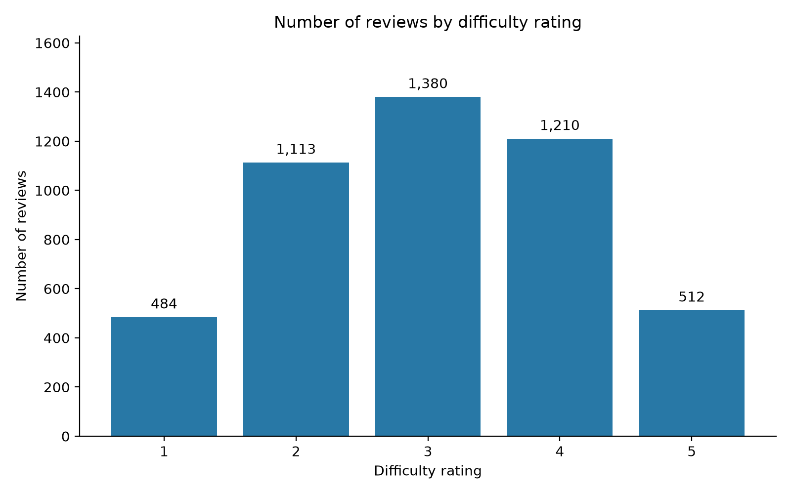
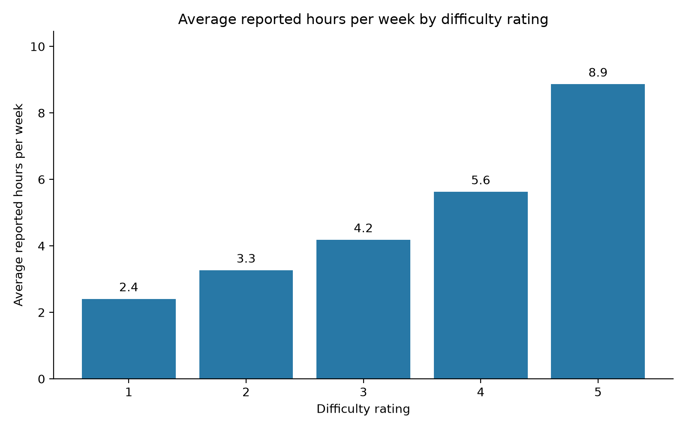

# Data documentation

## Data Summary

Our dataset contains 4,699 student reviews from theCourseForum. Each row is one collected review. There are 18 columns covering the written review, ratings, course details, and collection information. The file includes 56 departments, 425 course codes, and 452 instructor names.

Our model uses the cleaned `review_text` to predict `difficulty_rating`, which ranges from 1 to 5. Other rating columns, instructor names, and reported hours are not separate inputs to the model. Both required columns have no missing values.

## Provenance

The team collected reviews directly from theCourseForum's course and instructor pages using `scripts/thecourseforum_all_reviews_scraper.py`. Our project overview [1] records collection on September 15 and 16, 2026. The saved `scraped_at` timestamps are in UTC and range from September 16, 2026, at 01:53 to 23:55; collection dates can differ by time zone. The `source_url` column records the page used for each review.

The original file is `thecourseforum_all_reviews (1).csv`. Keep its rows in their original order so the same split can be repeated. The scraper is kept to document collection, not to collect more reviews.

## License

As explained in our project overview [1], theCourseForum gave us permission to use the data we had already collected for this class project. The conditions were to keep the raw data off public GitHub, not try to identify reviewers, and not continue scraping the website. Any additional data should be requested directly from theCourseForum.

The dataset is not covered by our code's MIT license. The raw review CSV is excluded from new Git commits. We can keep the embeddings in our private team repository. These contain the numbers used to represent the reviews and their ratings, rather than the written reviews. This does not give us permission to publish the original reviews. Our permission covers the team and professor, so we need to check before sharing the data with other groups.

We will share the raw CSV directly and privately with our professor. The professor can request it from our team, then place it in the `data` folder as explained below. There is no public download link. We need to confirm permission before sharing with classmates.

## Ethical Statements

We use this data to study whether review text can predict a student's difficulty rating. We do not try to identify reviewers or use their writing to work out who they are. The dataset does not have columns for student names or emails, but review text may still contain personal details, so we keep the text private. Instructor names are present in the original data but are not used as a separate model input.

Ratings reflect student opinions, not an objective measure of course difficulty. Students choose whether to post reviews, so these reviews may not represent every student's experience. Our plots show totals and averages, without quoting individual reviews.

## Data Dictionary

The types below describe the contents. The CSV itself stores text, and Python converts number columns when loading them. Empty cells mean missing values, not zero.

| Column | Type | Meaning and current notes |
|---|---|---|
| `review_id` | Text | Identifier created by the scraper. All 4,699 are present and unique. |
| `department` | Text | Academic department; 56 different values, none missing. |
| `course_code` | Text | Course subject and number; 425 different values, none missing. |
| `course_title` | Text | Intended course name; all 4,699 values are missing. Not used. |
| `instructor_name` | Text | Instructor associated with the review; 452 different names, none missing. |
| `semester_taken` | Text | Reported term and year; none missing. |
| `review_date` | Date stored as text | Posting date extracted by the scraper; 71 missing. |
| `overall_rating` | Number | Intended overall rating; 4,698 missing. Not used. |
| `difficulty_rating` | Number, 1 to 5 | Student's difficulty rating and the value we predict. All values are whole-number ratings, stored as decimals in the CSV. None missing. |
| `instructor_rating` | Number | Student's instructor rating; none missing. Not used as a model input. |
| `enjoyability_rating` | Number | Student's course enjoyment rating; none missing. Not used as a model input. |
| `recommend_rating` | Number | Recommendation rating. The project overview reports three values outside the expected 1-to-5 scale. Not used or repaired by our model preparation. |
| `hours_per_week` | Number | Reported weekly workload; none missing. Used for the second data plot, not the prediction model. |
| `upvotes` | Whole number | Intended review vote count. All values are 0, so collection may not have captured votes correctly. |
| `review_text` | Text | Collected review text, including some webpage information removed before modeling. None missing. |
| `review_url` | Text | Intended direct review link; all 4,699 values are missing. |
| `source_url` | Text | Page where the review was collected; none missing. |
| `scraped_at` | Timestamp stored as text | Time the scraper collected the review, including the UTC time zone; none missing. |

There are 4,698 different review texts across 4,699 rows, so one text appears twice. Matching text alone does not tell us whether those rows are the same review. We kept both rows in the current split. Before doing more analysis, we should check whether this creates overlap between the groups.

## Explanatory Plots

These plots follow the two questions in our project overview and were recreated from the current original CSV. Run `.\.venv\Scripts\python.exe scripts/describe_review_data.py` from the project folder to save them in `output/` again.

### Number of reviews by difficulty rating



Ratings are not equally common. There are 484 reviews rated 1, 1,113 rated 2, 1,380 rated 3, 1,210 rated 4, and 512 rated 5. This is why we keep a similar rating mix in each split and check the confusion matrices rather than relying only on one overall score.

### Average reported hours per week by difficulty rating



Average reported hours increase across the rating groups: about 2.4, 3.3, 4.2, 5.6, and 8.9 hours for ratings 1 through 5. The two measures increase together in this dataset, but that does not prove that spending more hours causes a higher difficulty rating. Hours are not used to train our model because our question focuses on predicting ratings from written reviews.

## Files and preparation

After receiving access to the raw CourseForum CSV, download it and place it in the project's `data` folder with this exact filename:

```text
data/thecourseforum_all_reviews (1).csv
```

The preparation script looks here to load the reviews, clean the text, split the reviews into training, validation, and test groups, and create the embeddings. The data plotting script also reads this file to create the two plots below. You can open the CSV in VS Code or a spreadsheet program to look at it, but keep the original values and row order unchanged.

The raw CSV is not included when you clone the repository. If you already have `data/embeddings_cleaned_new.npz`, you can run `scripts/difficulty_model.py` without the raw CSV. You only need the CSV to inspect the original reviews, recreate the data plots, or prepare the embeddings again.

| File | What it contains |
|---|---|
| `thecourseforum_all_reviews (1).csv` | Original collected reviews and ratings; private |
| `embeddings_cleaned_new.npz` | Review embeddings and matching ratings for the three groups; allowed in the private team repository |
| `README.md` | This documentation; can be included in GitHub |

`scripts/prepare_review_embeddings.py` removes the matched webpage heading with the term, year, and average rating, plus the vote count and date at the end of the review. It keeps the student's text between them. The current code does not add separate lowercase conversion or HTML/Markdown removal. We originally planned to remove rows with missing reviews or ratings. The current script stops and asks us to check them instead. Neither column has missing values in this dataset.

The script uses two splits with `random_state=42`, keeping a similar mix of ratings in each group. It produces 3,289 training reviews, 705 validation reviews, and 705 test reviews. MiniLM turns each cleaned review into 384 numbers without splitting long reviews into chunks. Text beyond the model's length limit is cut off.

The saved file contains `X_train`, `X_val`, and `X_test`, which hold the review numbers, and `y_train`, `y_val`, and `y_test`, which hold the actual ratings. Each row must stay matched with its rating. The shapes are `(3289, 384)`, `(705, 384)`, and `(705, 384)` for the embeddings, with one rating per row.

If you save embeddings under a different filename or in a different folder, update `input_path` near the top of `scripts/difficulty_model.py` to match. For example, `data/embeddings_updated.npz` needs:

```python
input_path = root / "data/embeddings_updated.npz"
```

If you keep the same filename and folder, you do not need to change the code. After replacing the file or switching to a different one, run the difficulty model again to update the scores and graphs. Update the written results in the READMEs and `output/model_results.md` if the scores change.

## References

[1] Z. Saadi, E. Boyden, and A. Nguyen, "Predicting theCourseForum Review Difficulty Rating Based On Student Reviews," DS 4002, Section 001, University of Virginia, project overview, Sep. 18, 2026. Team-provided document; includes the data establishment and permission summary.

[2] theCourseForum, "theCourseForum." [Online]. Available: https://thecourseforum.com/. Source of the collected reviews; access date recorded in the project overview: Sep. 14, 2026.
